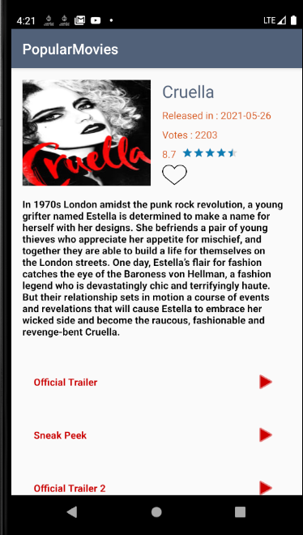
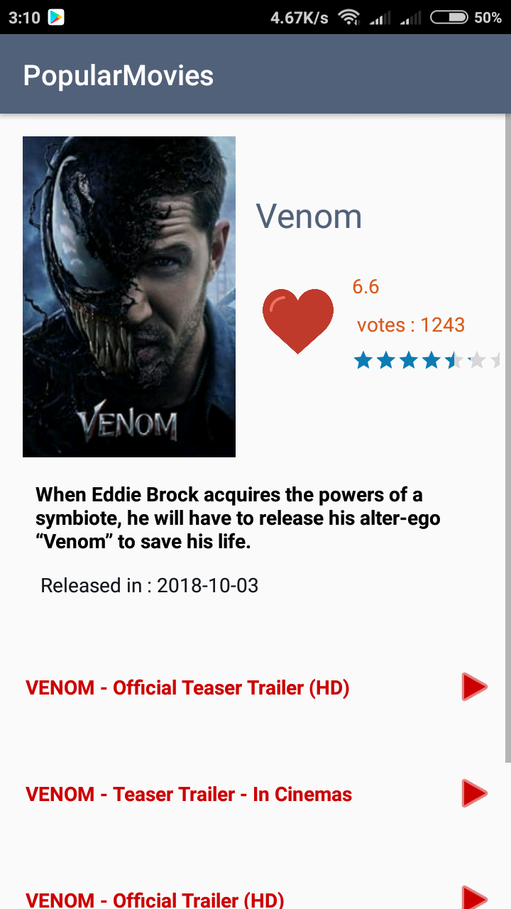

# PopularMovies
Android Sample app to show user latest movies implementing Kotlin + MVVM + Architecture components .

**The goal of this app is to show how to implement MVVM design pattern with architecture components in Kotlin .**

##  Source Code representation :
The repository has two branches

1-master : It has the implementaion of latest technologies such as kotlin coroutines, workManager, LiveData and repository pattern.
 ** Its the newest & latest version of the updated code .
 
2-RxBranch : It has the implementation using RxJava and its the older version .

- data : Contains data layer (local & remote)
- di : Contains the dependency injection Modules & Components
- ui : Contains the view layer (views & viewModels)
- utils : Contains helper classes and custom data-binding utils

**Please note that each developer has his own style in coding ,The goal is to implement the concepts of the design and architecting in the right way .**

 
### Contribution

Please feel free to make a pull request .

### Rate

If you find this repository useful please give it a star .
