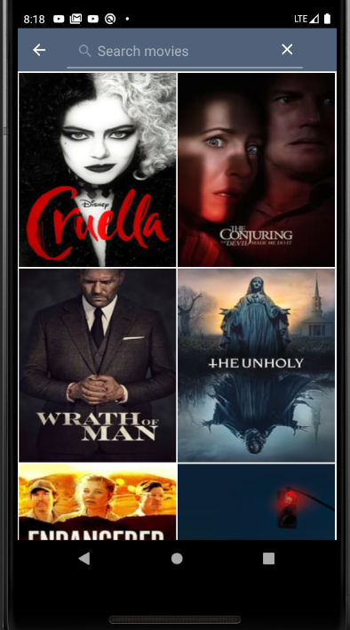
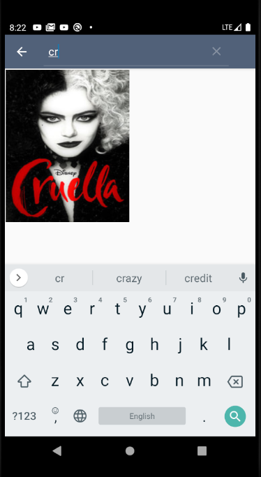

# PopularMovies
Android Sample app to show user latest movies implementing  MVVM + Clean Architecture using kotlin following solid and clean code principles .

**The goal of this app is to show how to implement MVVM design pattern with architecture components & clean architecture in Kotlin .**

##  Tech stack:

Kotlin, MVVM, Retrofit, Room, Coroutines, Dagger2, Navigation-component, Unit-Testing(Mockito), Ui-testing(Espresso), Package by feature.

##  Source Code representation :

- base : Base level classes (Activity, Fragment & Viewmodel).
- main : MainActivity handling navigation between fragment using navigation component.
- movies : Main Screen with grid displaying all movies list.
- detail : Detail screen displaying selected movie details & trailer list.
- utils : Configuration for Network layer, Database & Dagger alongside helper classes.

**Each package is divided into multiple packages demonstrated as following.**

- data : Contains data layer which has local & remote data sources with repository implementation.
- domain : Contains the domain layer wiht factory logic & mapper before.
- di : Contains all dagger depndencies mapping.
- presentation : Contains the view layer that consists of views & viewModels.

**Please note that each developer has his own style in coding ,The goal is to implement the concepts of the design and architecting in the right way .**

### Contribution

Please feel free to make a pull request or fork.

### Rate

If you find this repository useful please give it a star .
